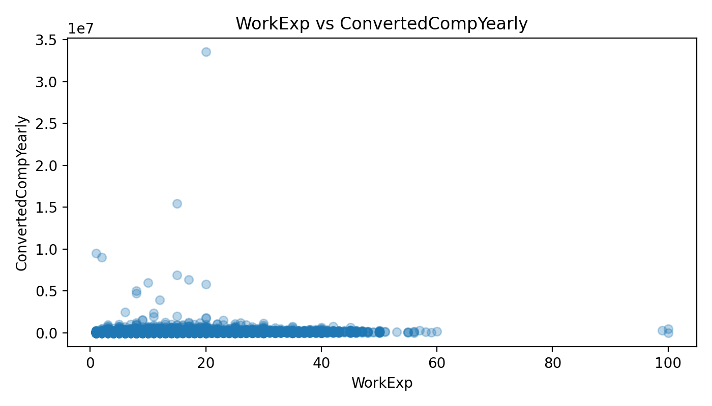

# What Influences Developer Salaries? (Stack Overflow Survey)

## Questions
1) Does work experience influence yearly compensation?  
2) Is job satisfaction related to compensation?  
3) Can we predict compensation using a simple model?

## Findings (non-technical)
**1) Experience matters, but it’s not the whole story.**  
In general, developers with more work experience tend to report higher yearly compensation.

**2) Job satisfaction shows a relationship, but it’s not a perfect signal.**  
Satisfaction may reflect work conditions, but salaries are also shaped by many other factors.

**3) A simple model can estimate, but it can’t fully explain salaries.**  
Using only a few variables, the model captures only a small part of salary differences.  
This suggests that location, role, and company characteristics matter a lot too.

### Visualization

**Insight:** The plot shows a general upward trend: more work experience tends to be associated with higher yearly compensation, but the spread is wide—suggesting other factors (role, location, company) also play a big role.

## Predictive scenario
For example, a developer with 10 years of work experience, 8 years of coding experience,  
and a job satisfaction score of 7 is predicted to earn around **$68k/year**.

## Conclusion
This analysis shows how a few measurable factors relate to compensation,  
while also highlighting that salary is influenced by many variables not included here.
