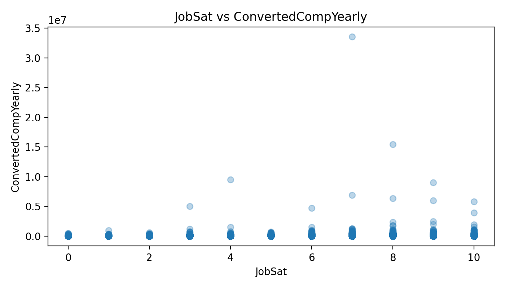
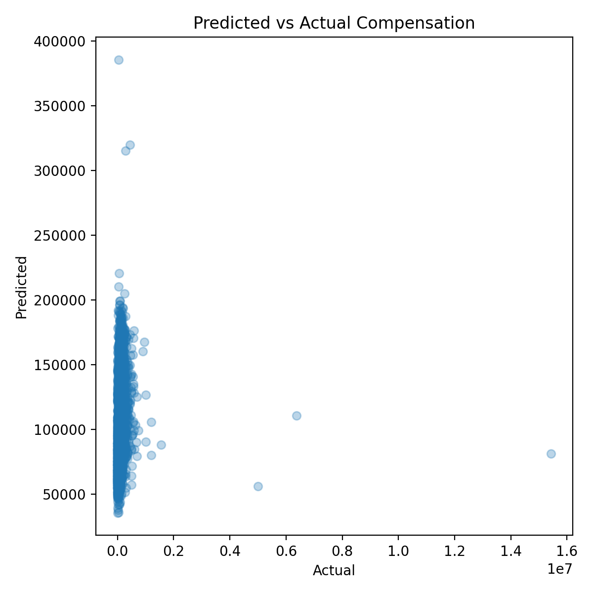

# What Influences Developer Salaries? (Stack Overflow Survey)

## Questions (and hypotheses)
### Q1) Does work experience influence yearly compensation?
**Hypothesis:** More work experience is associated with higher compensation.

### Q2) Is job satisfaction related to compensation?
**Hypothesis:** Higher job satisfaction is associated with higher compensation.

### Q3) Can we predict compensation using a simple model?
**Hypothesis:** A simple model can estimate compensation, but it will not fully explain salary differences.

---

## Results (non-technical)

### Q1) Work experience vs yearly compensation
**Result:** Compensation generally increases with work experience, but results vary widely across individuals.  
**Conclusion vs hypothesis:** ✅ Supports the hypothesis (overall upward trend), but experience alone is not enough to explain salary.

**Visualization:**  

**What this means for stakeholders:**  
More experience is usually linked to higher pay, but the wide spread suggests other factors (such as role, location, and company) also strongly influence compensation.

---

### Q2) Job satisfaction vs yearly compensation
**Result:** Job satisfaction shows a relationship with compensation, but it is weak/noisy and not a reliable signal by itself.  
**Conclusion vs hypothesis:** ⚠️ Partially supports the hypothesis, but not strongly (relationship is not consistent).

**Visualization:**  

**What this means for stakeholders:**  
Higher satisfaction can appear alongside higher pay in some cases, but many highly paid respondents still report lower satisfaction (and vice versa), so satisfaction alone should not be used to infer salary.

---

### Q3) Simple model: predicted vs actual compensation
**Result:** The model can produce a rough estimate, but many predictions differ substantially from actual salaries.  
**Conclusion vs hypothesis:** ✅ Supports the hypothesis (some explanatory power, but clearly incomplete).

**Visualization:**  

**What this means for stakeholders:**  
Even with experience and satisfaction, salary remains hard to predict accurately. This suggests that key drivers not included here (e.g., location, role, seniority, company size) likely explain a large part of salary differences.

---

## Example scenario (from the notebook)
A developer with **10 years of work experience**, **8 years of coding experience**, and a **job satisfaction score of 7** is predicted to earn around **$68k/year**.

## Final takeaway
Work experience matters, job satisfaction has a weaker signal, and a simple model is useful as a baseline—but salary is shaped by multiple additional factors not captured in this small subset.